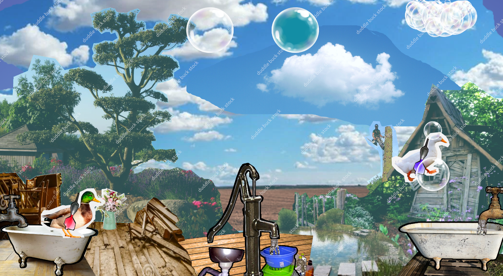

# Duddle Buck: kick the Bubbles!

This is a funny two player game where you can choose your duck to explose bubbles

# Credits

Made for the "Global GameJam 2025" with "Les portes logiques" Team @FLUX

* Game Design : Chiara & Emoc
* Art Design : Aurore & Emoc
* Music & Sound Design : Chiara & Lina
* Coding : Davide & Yann

Official [GGJ page for the game](https://globalgamejam.org/games/2025/duddle-buck-3)

## Requirements

[Node.js](https://nodejs.org) is required to install dependencies and run scripts via `npm`.

## Available Commands

| Command | Description |
|---------|-------------|
| `npm install` | Install project dependencies |
| `npm run dev` | Launch a development web server |
| `npm run build` | Create a production build in the `dist` folder |
| `npm run dev-nolog` | Launch a development web server without sending anonymous data (see "About log.js" below) |
| `npm run build-nolog` | Create a production build in the `dist` folder without sending anonymous data (see "About log.js" below) |

Created With [Phaser Studio](mailto:support@phaser.io). Powered by coffee, anime, pixels and love.
